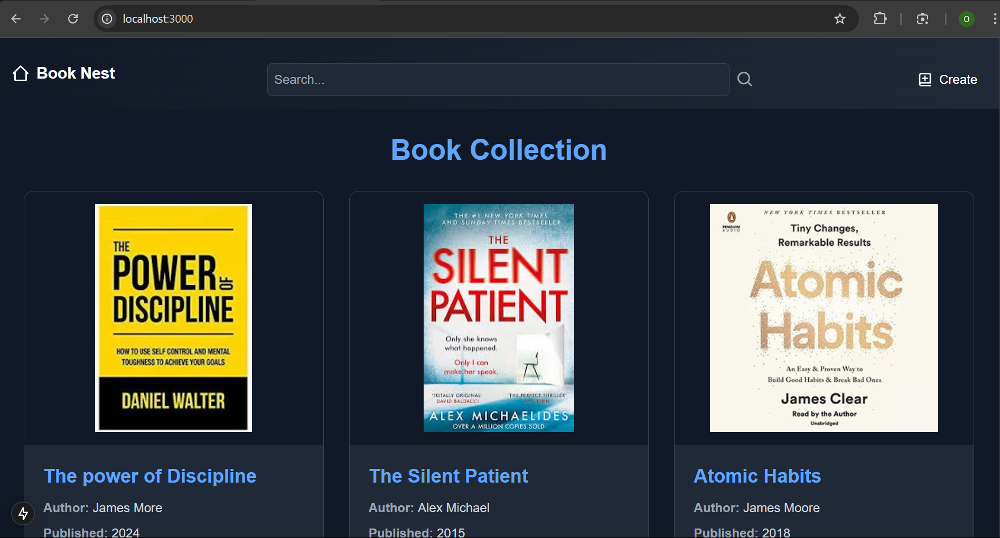
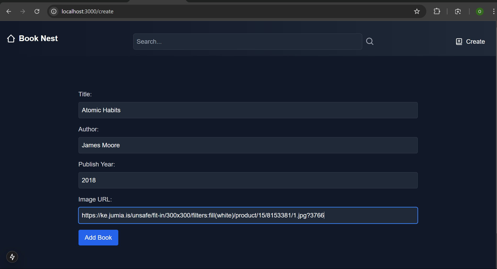
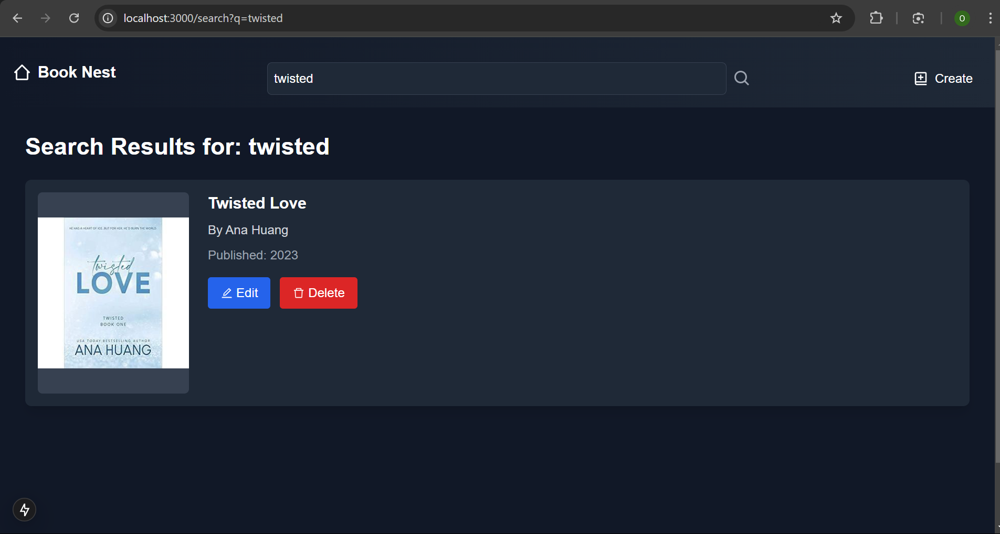

# BookNest 📚

BookNest is a modern web application for managing a digital book collection. Built with Next.js and Node.js, it provides a seamless interface for creating, reading, updating, and deleting book entries.



## Features ✨

- **Book Management**: Add, edit, and delete books from your collection
- **Search Functionality**: Quickly find books in your library
- **Dark Theme**: Easy on the eyes with a modern dark interface
- **Responsive Design**: Works seamlessly on desktop and mobile devices
- **Image Support**: Display book covers with proper image handling

## Screenshots 📸

### Home Page


### Create New Book


### Search Books


## Tech Stack 🛠️

### Frontend
- Next.js 14
- Tailwind CSS
- Axios
- React Icons

### Backend
- Node.js
- Express.js
- MongoDB
- Mongoose

## Getting Started 🚀

### Prerequisites
- Node.js (v14 or higher)
- MongoDB
- Git

### Installation

1. Clone the repository

```bash
git clone https://github.com/onesmuskipchumba0/BookNest.git
cd BookNest
```

2. Install frontend dependencies

```bash
cd frontend
npm install
```

3. Install backend dependencies

```bash
cd backend
npm install
```

4. Create a `.env` file in the backend directory

```env
MONGODB_URI=your_mongodb_connection_string
PORT=5000
```

5. Start the development servers

Backend:

```bash
cd backend
npm run dev
```

Frontend:

```bash
cd frontend
npm run dev
```

The application will be available at `http://localhost:3000`

## API Endpoints 🔌

- `GET /api/books` - Get all books
- `GET /api/books/:id` - Get a specific book
- `POST /api/books` - Create a new book
- `PUT /api/books/:id` - Update a book
- `DELETE /api/books/:id` - Delete a book

## Contributing 🤝

Contributions are welcome! Please feel free to submit a Pull Request.

1. Fork the project
2. Create your feature branch (`git checkout -b feature/AmazingFeature`)
3. Commit your changes (`git commit -m 'Add some AmazingFeature'`)
4. Push to the branch (`git push origin feature/AmazingFeature`)
5. Open a Pull Request

## Author ✍️

**Onesmus Bett**
- Email: onesmuskipchumba5@gmail.com
- GitHub: [@onesmuskipchumba0](https://github.com/onesmuskipchumba0)

## License 📝

This project is licensed under the MIT License - see the [LICENSE](LICENSE) file for details

## Acknowledgments 🙏

- Thanks to all contributors who have helped shape BookNest
- Special thanks to the Next.js and Node.js communities for their excellent documentation
